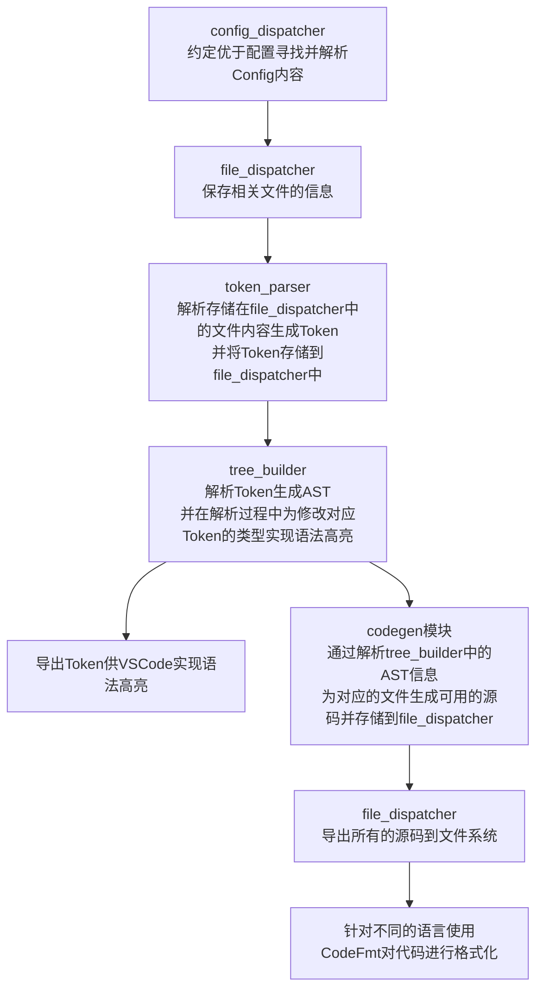

# Omi Codegen

Omi Codegen是一个通过使用DSL生成代码从而降低前端和服务端之间通信成本的CLI工具。

# 用法

使用这个工具首先需要使用npm全局安装Omi Codegen CLI工具：

```
$ npm i -g @omi-stack/omi-idl
```

然后使用DSL在任意目录下创建IDL文件：

```
// test/test-idl/todo.omi
struct Todo {
  int Id;
  string Content;
  boolean Checked;
}

service TodoService {
  Todo GetTodo();
}
```

```
// test/test-idl/user.omi
import { Todo } from "./todo.omi";

struct User {
  int id;
}

service UserTask {
  Todo GetUserTask(User usr);
  void PostUserTask(Todo todo);
}
```

接下来，在需要进行代码生成的项目根目录下创建文件`omi.config.json`，内容如下：

```json
[
  {
    "entry": ["test/test-idl/todo.omi"],
    "lang": "ts",
    "targetDir": "./test/server-ts/idl-lib",
    "method": "server"
  },
  {
    "entry": ["test/test-idl/todo.omi"],
    "lang": "ts",
    "targetDir": "./test/client-ts/idl-lib",
    "method": "client"
  },
  {
    "entry": ["test/test-idl/todo.omi", "test/test-idl/user.omi"],
    "lang": "go",
    "targetDir": "./test/client-go/idl-lib",
    "method": "client",
    "packageRoot": "github.com/sheason2019/idl-lib"
  },
  {
    "entry": ["test/test-idl"],
    "lang": "go",
    "targetDir": "./test/server-go/idl-lib",
    "method": "server",
    "packageRoot": "github.com/sheason2019/idl-lib"
  }
]
```

JSON的内容可以包含多个对象，每个对象表示一个代码生成的Config。

- `entry` 表示需要进行代码生成的IDL文件，它也可以是一个目录，如果是目录，它会将该目录下的所有以`.omi`后缀结尾的文件加入生成列表。

- `lang` 表示代码生成的目标语言，目前支持Typescript和Golang，对应使用`ts`和`go`作为值来声明语言。

- `targetDir` 表示代码生成的位置。

- `method` 表示代码是为前端还是服务端生成的，这是因为前端和服务端针对接口生成的产物会有区别，`method`支持的值有`client`、`server`、`common`、`all`，`common`表示仅生成结构体，`all`表示既生成前端代码，也生成服务端代码。

- `packageRoot` 特别的，对于Golang，由于它不使用路径引用其他文件的内容，在目标语言为Go时，配置文件中必须声明`targetDir`在Go项目中的引用位置，从而实现各个IDL文件之间的互相引用。

接下来即可在命令行中使用`omi`命令生成对应的代码。

# 与上一版本的对比

在之前，我通过Node实现过一个版本的Omi Codegen，但当时因为对语法树方向的实践经验不是很多，所以整体代码的逻辑比较混乱，尤其在添加对VS Code的语法高亮支持以后，整个项目的耦合度高的惊人，近千行的文件难以被分割，导致代码的可读性非常低下。

造成这个问题的原因是当时的模块划分做的不是很好，在Node版本中，Token构建和AST构建是同时进行的，文件每寻找到一个Token，AST就会同步将这个Token解析；同时由于omi支持import功能，当时的文件调度功能也一起写进了Codegen对象中，导致整个项目的各种功能都乱成一团，虽然能运行，但后续维护的时候确实很让人头疼。

在第一版完成后的三四个月时间里，我逐渐意识到应该采用更加细分的模块设计来构建这个库，从而方便在以后添加一些更加定制化的功能，于是，我就开始思考能不能从架构方向上让这个项目变得更加易于维护，在草稿纸上乱涂乱画了几张流程图之后，我终于确定了自己接下来应当完成的工作。

## 新版本的设计

首先项目不再使用Shell配合CLI的方式来进行代码生成，而是改用配置文件去声明Codegen的输入和输出。

然后，我们需要根据Codegen的工作流程对模块进行划分：



现在的工作流程大体可以理解为上图所示的这样，虽然有些部分实现的还是比较乱，但比起第一版无疑还是能更加清晰一点。

## 语言上的转换

在设计好新架构以后，实际上的问题已经解决了一大半。

但在实现的过程中，由于以ES Build为代表的其他语言构建的工程化工具在近几年崭露头角，让我一下也失了智，想尝试一下使用GO语言构建CLI。

结果就是，写的过程很愉快，但用的时候问题就开始暴露了。

一方面是Omi是自定义的DSL，想要获得语法高亮支持就必须使用VSC扩展将Token信息传给VSC，但VSC扩展只支持Nodejs，结果导致我只能使用child_process去绕一圈解决这个问题。

另一方面，由于Go编译出来的二进制产物需要处理跨平台问题，所以到时候如果我需要在不同的机器上使用这个CLI，可能还需要模仿ESBuild那样通过PostInstall钩子和交叉编译发包实现动态拉取二进制文件。


